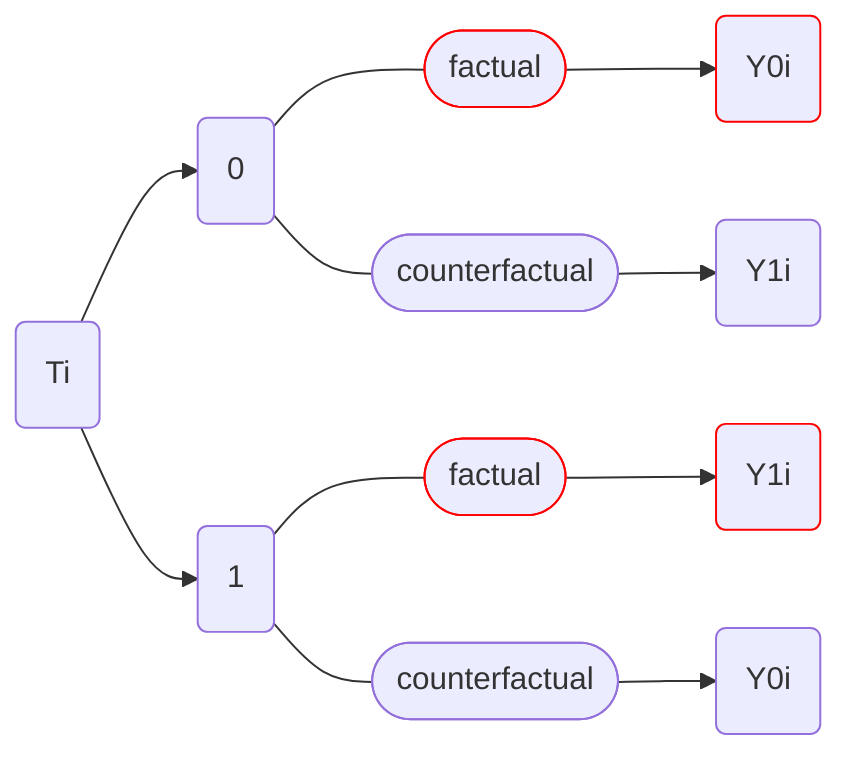

### _01 Introduction To Causal Inference_</br></br>

`Treatment (T)`
```
Ti(0) = Individual i did not receive the treatment
Ti(1) = Individual i received the treatment
```

`Potential Outcome (Y)`
```
Yi(0) = Y0i = Potential outcome for unit i without the treatment
Yi(1) = Y1i = Potential outcome for the same unit i with the treatment
```
</br>

***Factual and Counterfactual Graph***</br>
>In the case where individual `i` is not treated, $`T0_i`$, the factual outcome would be $`Y0_i`$ whilst counterfactual outcome is $`Y1_i`$


>[!Note]
><sup>Counterfactual can't coexist with the factual event and be explicitly observed since the same individual `i` should be treated under the same condition (=Impossible)</sup>
